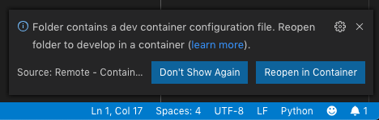
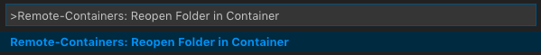
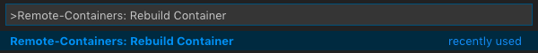

# Oracle Developer's Python Starter Kit for VS Code Remote - Containers Extension

Visual Studio Code (VS Code) provides [extensions](https://code.visualstudio.com/docs/editor/extension-gallery) for working with remote machines. This includes the [Remote - Containers](https://marketplace.visualstudio.com/items?itemName=ms-vscode-remote.remote-containers) that allows developers to use [Docker](https://www.docker.com/) containers as a self-contained development environment.

Using containers has many benefits. It allows developers to maintain a consistent development environment that can be easily moved or copied onto other workstations or by other developers. It creates a sandbox environment that shields your host system from unnecessary software components, that is especialy crucial when experimenting and documenting.

Using this starter kit, an Oracle Developer can quickly get started with developing in [Python](https://www.python.org/), within a development container (devcontainer).

## Software Requirements

* *Microsoft Visual Studio Code* [[Download](https://code.visualstudio.com/)]
* *Remote - Container* extension - Install the [Remote Development](https://marketplace.visualstudio.com/items?itemName=ms-vscode-remote.vscode-remote-extensionpack) pack or just the [extension](https://marketplace.visualstudio.com/items?itemName=ms-vscode-remote.remote-containers).
* *Docker* - Follow the [instructions](https://docs.docker.com/install/) to install Docker Community Edition for your host operating system. 

## Getting Started

The starter kit runs a Docker container with the following components for Python development:

* Oracle Instant Client Release 19.3
* Oracle SQL*Plus
* Python 3.x
* [cx_Oracle](https://oracle.github.io/python-cx_Oracle/)
* [Oracle Cloud Infrastructure](https://cloud.oracle.com) (OCI) [Python SDK](https://oracle-cloud-infrastructure-python-sdk.readthedocs.io)
* Git
* Microsoft's [Python extension for VS Code](https://marketplace.visualstudio.com/items?itemName=ms-python.python)
* [pylint](https://www.pylint.org/)

Place any additional Python libraries required by the project in the [`requirements.txt`](requirements.txt) file. **Do not** include *cx_Oracle* as it is already included in the Docker build. Packages should be available on the [Python Package Index](https://pypi.org/).

The devcontainer installs the VS Code extension for Python and configure *pylint* as the linter. Add any additional extensions required in the `extensions` attribute in the [`devcontainer.json`](.devcontainer/devcontainer.json) file. For example, this adds the [*Language PL/SQL*](https://marketplace.visualstudio.com/items?itemName=xyz.plsql-language) extension:

```json
"extensions": [ "ms-python.python", "xyz.plsql-language" ]
```

1. Build a Docker image for running an Oracle Database using the instructions found [here](https://github.com/oracle/docker-images/blob/master/OracleDatabase/SingleInstance/README.md). Alternatively, for Linux and Mac users, there are scripts in the *[docker-apex-stack](https://github.com/fuzziebrain/docker-apex-stack)* that will facilitate the process and at the same time, provision a full [Oracle Application Express](https://apex.oracle.com) (APEX) stack.
1. Run a container using the image and attach it to a Docker [network](https://docs.docker.com/engine/reference/commandline/network/).
1. Clone the project:
    ```bash
    $ git clone https://github.com/fuzziebrain/vscode-remote-oradev-python.git
    ```
1. Modify the Docker network to attach to, in the [`devcontainer.json`](.devcontainer/devcontainer.json). For example, the following parameter attaches the devcontainer to the *axer_network* typically used with the *docker-apex-stack*:
    ```json
    "--network", "axer_network"
    ```
1. If a port is required to be exposed, add it to the attribute `appPort`. For example, *[Flask](https://flask.palletsprojects.com)* run on port `5000` by default:
    ```json
    "appPort": [ 5000 ]
    ```
1. Open the project directory in VS Code. It should detect the devcontainer and ask whether to reload the folder from within the container.<br>
    <br>
    <br>
    or<br> 
    <br>
    Run the command *Remote Containers: Reopen Folder in Container*<br>
    

### Modifying the Devcontainer

Customise the Docker container if necessary. To rebuild the container, run the command *Remote Containers: Rebuild Container*. This command is only available when the folder is opened in a devcontainer.



## Running Code

### Debugging

A debug configuration has been created. See [`launch.json`](.vscode/launch.json).

### Connecting to the Oracle Database

Developers are encouraged to store database credentials safely in encrypted Oracle Wallets, as oppose to storing them in plaintext either within the Python script or as environment variables. Follow the [*Oracle Database Connection with Oracle Wallet*](docs/oracle-database-connection-with-oracle-wallet.md) guide.

### Support for Oracle Cloud Infrastructure

See [*Support for Oracle Cloud Infrasturcture Guide*](docs/support-for-oci.md).

## Credits

The beauty of [Open Source](https://opensource.org/) is that we can learn and build on top of previous knowledge shared by others. I wish to thank the following projects that have guided the creation of this starter kit:

1. Microsoft's [Try Out Development Containers: Python](https://github.com/microsoft/vscode-remote-try-python)
1. Oracle's [Docker Images](https://github.com/oracle/docker-images)

## License

Please see [LICENSE](LICENSE).